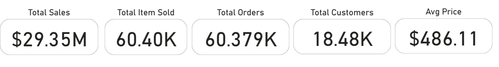

## SQL Data Analysis and Reporting Project

This project involves **exploratory data analysis (EDA)** and **report building** using SQL and Power BI. The dataset includes customer, product, and sales transaction data.

#### Tasks:

- Performed data cleaning and transformation using SQL on PostgreSQL (Data Warehouse)
- Generated Key Performance Indicators (KPIs) like total sales, average price, and sold items
- Identified top-performing products, regions, and categories
- Visualized trends across time, geography, and product hierarchy
- [Build a comprehensive analysis report](https://github.com/dharmeshrohit/SQL-Data-Analytics-Project/blob/main/docs/Bike%20sales%20analysis%20report.pdf)

Tools used: **PostgreSQL**, **Power BI**, **PowerPoint**

Focus: Data exploration, business intelligence, decision-making insights

---
### Dataset:
Datawithbaraa(YouTube)  
Build a Data WareHouse: [Project Repository](https://github.com/dharmeshrohit/SQL-DataWarehouse-Project)

Data:  
- `gold.dim_customers.csv`
- `gold.dim_products.csv`
- `gold.fact_sales.csv`

---
## Exploratory Data Analysis
 Date range of the data: "2010-12-29“ to "2014-01-28“
### Key Performance Indicators (KPIs)

 - The business generated $29.35 million in revenue, with over 60,420 products sold.
 - A total of 60,379 transactions were recorded, placed by approximately 18,484 unique customers.
 - The average price per item across all sales is $486.11, indicating a mid-to-premium product 
range.

### Geographic Sales Distribution:

- The United States ($9.16M) and Australia 
($9.06M) are the top-performing markets, 
together contributing over 60% of total sales.
 - The United Kingdom ($3.39M), Germany 
($2.89M), and France ($2.64M) show strong mid
tier performance.
- Canada ($1.98M) presents potential for growth.
- Around $230K worth of sales have no country 
associated, indicating data quality issues or 
unclassified records.
- Recommendation:Prioritize marketing efforts in 
the US and Australia, and investigate the “n/a” 
country data for cleanup.
- Other countries like Canada (1,571) and the "n/a" group (337) trail behind.

### Sales by Category & Subcategory

  
  

- Bikes are the clear leader, accounting for $28.31M in revenue. 
96.46% of total sales.
- Accessories and Clothing contribute $699.9K and $339.7K, 
respectively, suggesting potential for growth through bundling or 
promotions.

### Sales Trend by Year (2010–2014)

- Sales began in 2010 at $43K, marking the start of operations.
- In 2011, sales jumped to $7.08M, showing strong early growth.
- In 2012, there was a slight dip to $5.84M, possibly due to market saturation or seasonal 
changes.
- A major spike occurred in 2013, reaching $16.35M, the highest on record — more than 2.5x
 growth from 2012.
- 2014shows only $45K in sales, indicating the year was either incomplete in the data or 
represents a shutdown/transition period.
---
### Recommendations Summary
1. Diversify Product Portfolio to Reduce Risk*
    - While the Bikes category contributes 96% of total sales, this over-reliance poses a significant business risk. If market demand shifts, supply issues arise, or competition increases, the impact could be severe.
    - Invest in growing Accessories and Clothing through product innovation, better positioning, and 
    targeted promotions.
    - Explore customer bundle behavior to understand what complementary products can be cross
    sold or upgraded.
    - Launch seasonal or trend-based collections to stimulate demand outside core bike sales.
    - Diversifying revenue streams will stabilize the business and create more resilience in the long 
    term.
2. Prioritize Top Markets
    - The United States and Australia contribute >60% of total revenue.
    - Increase targeted advertising, partnerships, and stock availability in these regions.
3. Improve Data Quality
    - Resolve "n/a" entries in country and product fields (~$230K in sales, 871 items).
    - Clean, complete data improves analytics, targeting, and reporting accuracy.
4. Plan for Seasonal Peaks
    - Sales peaked massively in 2013 ($16.35M) after a dip in 2012.
    - Investigate what drove this growth (e.g., campaigns, launches) and replicate the strategy during 
    future seasons.
 5. Boost Cross-Selling Opportunities
    - Low accessory and clothing sales suggest missed cross-sell potential.
    - Promote kits, bundles, or checkout suggestions to raise accessory sales per order